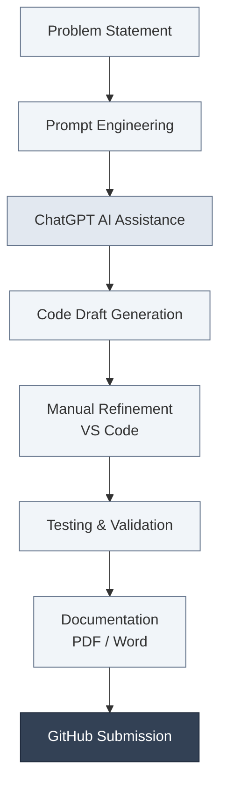

   

  ## 💠 **AI-Assisted Coding Portfolio**
  **Student:** Palakurthi Lalith Prakash  •  **ID:** 2303A52012  •  **Batch:** 31

  
  
  

   
  
  ---

## ✨ **Lab Assignments Dashboard**
*Select a block below to view the assignment documentation.*

  
  
  
  
  

   

  
  
  
  
  

   

  
  
  
  
  

   

  
  
  
  
  

   

  
  
  
  
  

---

## 🧰 **Software & AI Tools Used**

---

## 🔄 **Tools Workflow Architecture**

---

## **Academic Declaration**

These assignments are prepared strictly for academic purposes.
AI tools were used only for assistance in code generation and explanation.
All final implementations, validations, and justifications reflect the student’s original understanding and effort.

Maintained by Palakurthi Lalith Prakash • 2026

 
